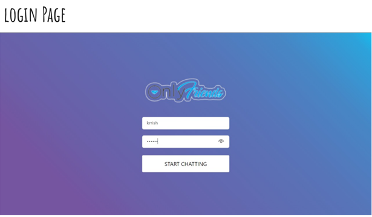
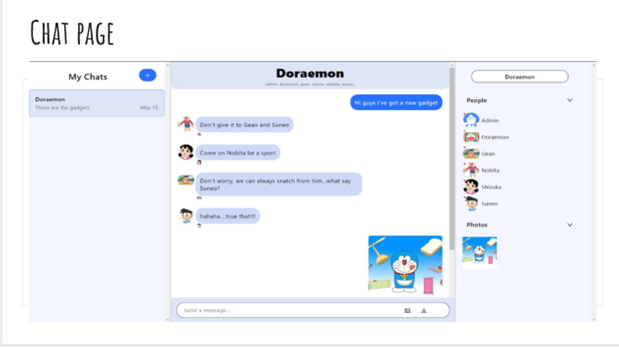
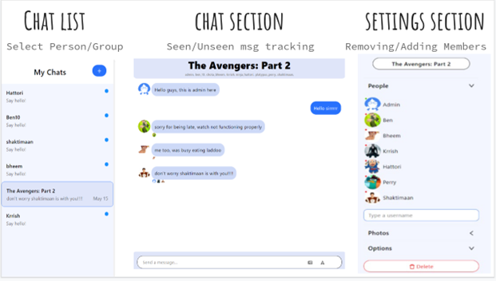

# Web Messaging App

This project is a **web-based messaging application** designed to facilitate interaction between students, peers, and businesses. The app features real-time communication, a clean and interactive UI, and strong privacy measures to ensure a secure user experience.

### Key Features:
- **Instant Messaging**: Real-time, two-way messaging with immediate updates.
- **Online/Offline Status**: Displays user availability and tracks status in group chats.
- **Group Chats**: Create and manage multiple participants in a single chat room.
- **Admin Control**: Provides administrators with the authority to manage group members and permissions.
- **Media Sharing**: Send images, stickers, and files seamlessly.
- **User-Friendly Interface**: Designed for simple navigation and minimal distractions.
- **Privacy & Security**: Data protection and secure communication channels implemented to ensure user privacy.

### Tech Stack:
- **Frontend**: HTML, CSS, JavaScript, ReactJS
- **Real-Time Messaging**: Chat-engine integrated with PubNub's Data Stream Network (DSN) for instant updates and user status tracking.
- **Server Communication**: REST APIs to send and receive data in JSON format.
- **Persistent Connection**: WebSockets for continuous, bidirectional communication between the client and server.

